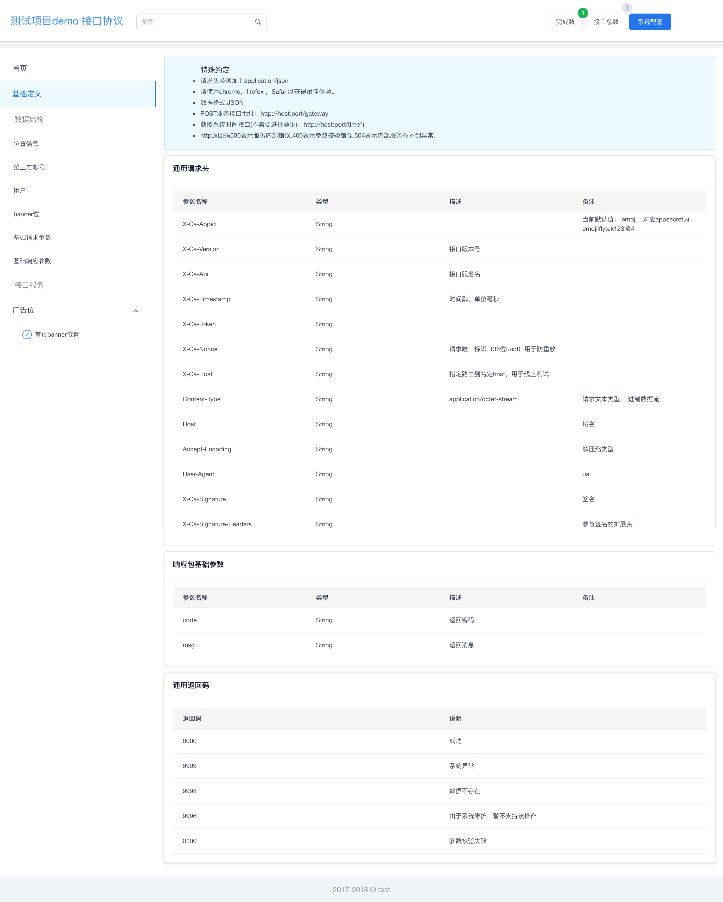
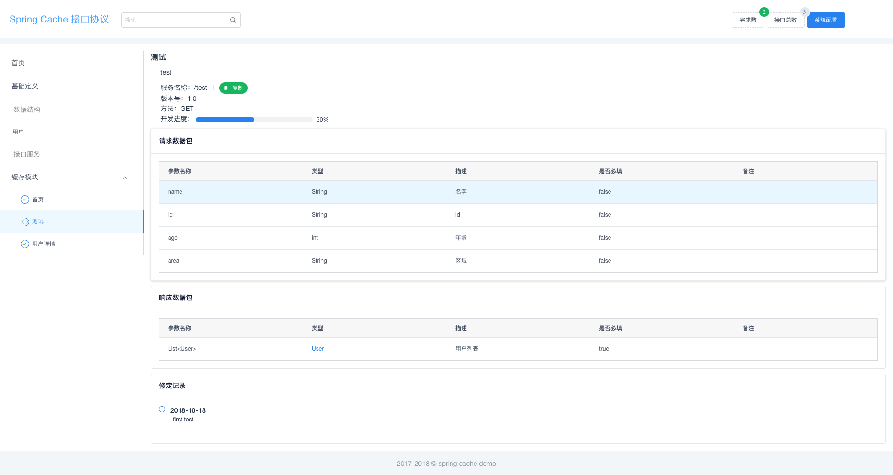

# Hello Doc


> Hello Doc是一款快译通通过代码生成漂亮的api在线文档工具，支持java快速生成接口文档

运行demo：[demo](https://yoqu.gitee.io/hello-doc-demo)

## **快速集成** ：[集成指导](./guide.md)

## 特性
* 支持markdown（包含flowchat流程图）
* 参数实体跳转
* java注解支持
* 菜单快速筛选
* 接口搜索
* 接口统计

## 待实现功能
- [ ] mock接口
- [ ] swagger配置文件转换为hello doc
- [ ] markdown功能增强时序图等功能
- [ ] 文档工具国际化支持
- [ ] 文档工具接入在线评论支持评论功能
- [ ] 文档导出为pdf和word格式


## 截图展示：





## 运行本项目

### 启动前端功能

``` bash
# install dependencies
npm install

# serve with hot reload at localhost:8080
npm run dev

# build for production with minification
npm run build

# build for production and view the bundle analyzer report
npm run build --report
```

### 安装java-plugin

1. 执行java-plugins下的`build-html.sh`脚本打包前端工程至插件的resource目录下

2. 执行mvn install 安装所有依赖.

### 执行java-plugin

在具体项目上直接使用`mvn hello-docs:doc`
